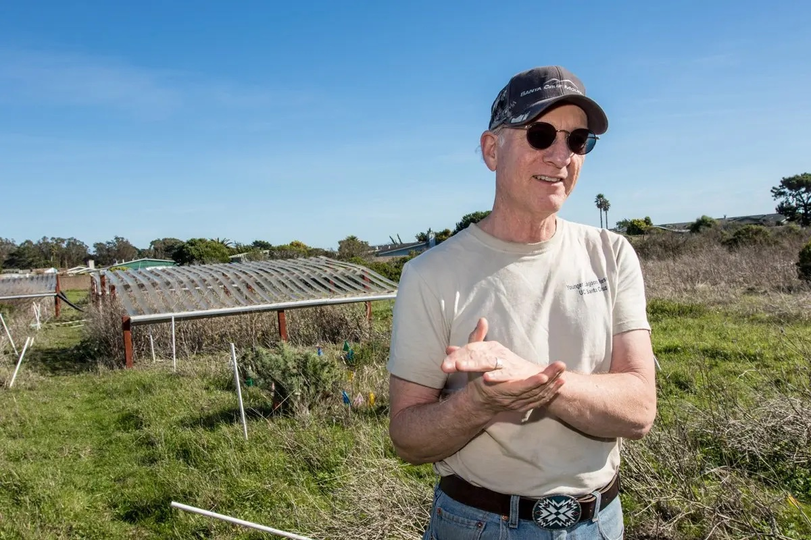

```{r setup, echo=FALSE, message=FALSE}
source("scripts/utils/setup.R")
knitr::opts_chunk$set(eval = FALSE)
```

Objectives

- Gather site information
- Clean up experimental community data (JRGCE, McLaughlin Water Exp, Santa Cruz IDE)
- Clean up observational community data (~10 datasets)
- Correct species names

Key results

- Raw data path: `data/community/raw/`
- Tidy data path: `data/community/tidy/`
- Processed data path: `data/community/`

# Study sites

```{r site-info, eval=TRUE}
source("scripts/input-site-info.R")
knitr::kable(site_sf)
```

```{r}
write_rds(site_sf, file = .path$geo_site)
rm(list = ls())
```

# Experimental community data

## Jasper Ridge Global Change Experiment


JRGCE data provided by Nona Chiariello. The raw CSV files include pin count, species, and treatment data.

```{r jrgce}
source("scripts/clean-jrgce.R")
write_csv(jrgce_tbl, str_c(.path$com_tidy, "jrgce.csv"))
rm(list = ls())
```

## McLaughlin Water Experiment

The experiment was introduced in Harrison, Susan P., Marina L. LaForgia, and Andrew M. Latimer. “Climate‐driven Diversity Change in Annual Grasslands: Drought plus Deluge Does Not Equal Normal.” Global Change Biology 24, no. 4 (April 2018): 1782–92. https://doi.org/10.1111/gcb.14018.

Susan's notes (email on 4/22/22):

- Treatments began in Fall 2015 and ended in Winter 2020.   The years in the datasheets refer to Spring sampling.   Thus, sampling year 2015 is pre-treatment data, and sampling year 2021 is one full year post-treatment.
- In practice it’s best to treat this as three separate sub-experiments.    On non-serpentine soil, the treatments are Watering and Watering Control.   On serpentine soil, there is also a watering experiment with treatments Watering and Watering Control.   On serpentine soil there is also a drought shelter experiment with treatments Shelter and Shelter Control.    The design was not conducive to analyzing these three sub-experiments all together.

```{r mclexp}
source("scripts/clean-mclexp.R")
write_csv(mclexp_tbl, str_c(.path$com_tidy, "mclexp.csv"))
rm(list = ls())
```

## Santa Cruz International Drought Experiment



Data provided by Michael Loik. 

```{r scide}
source("scripts/clean-scide.R")
write_csv(scide_tbl, str_c(.path$com_tidy, "scide.csv"))
rm(list = ls())
```

# Observational community data

## Angelo

These data were collected by K.B. Suttle from 2002 to 2015. 
```{r angelo}
source("scripts/clean-angelo.R")
write_csv(angelo_tbl, str_c(.path$com_tidy, "angelo.csv"))
rm(list = ls())
```

## Carrizo

Carrizo Plain data from Loralee Larios, from 2007 to 2021, updated on June 28, 2022. The data are taken in plots, with a variable number of plots measured annually. These data only have the control plots after 2015 so replication will go from 10 20m x 20m plots with 8 1m2 subplots  to 4 20m x 20m plots with 8 1m2 subplots. Those plots that are kept would correspond to Center Well plots 2, 3, 4, 6 and Swain plots 1,2,7,9.

Loralee's email (7/5/22) on Count vs. Count2:

> For the point of whether to use Count or Count2. I would suggest using Count 2, while this does capture species that were likely rare in that 1m2 plot, these species may be regionally dominant and just rare in that plot so I think it would give you a better representation of the range of abundance for a species. 

```{r carrizo}
source("scripts/clean-carrizo.R")
write_csv(carrizo_tbl, str_c(.path$com_tidy, "carrizo.csv"))
rm(list = ls())
```

## East Bay

East Bay Regional Park District (EBRPD) data from Joan Dudney. Three sites: PR = Pleasant Ridge, VC = Vasco Cave, SU = Sunol.

```{r eastbay}
source("scripts/clean-eastbay.R")
```

### Pleasanton Ridge

Include PR4-9 plots that have 10 yr of data, 2003-2012.

```{r pleasantonridge}
eastbay_tbl %>%
  filter(site == "PR", plot %in% str_c("PR", 4:9)) %>%
  mutate(site = "pleasantonridge") %>%
  write_csv(str_c(.path$com_tidy, "pleasantonridge.csv"))
```

### Sunol

Include SU1-6 plots that have 8 yr of data, 2005-2012. Include SU7-9 plots that have 7 yr of data, 2005-2011.

```{r sunol}
eastbay_tbl %>%
  filter(site == "SU", plot %in% str_c("SU", 1:9)) %>%
  mutate(site = "sunol") %>%
  write_csv(str_c(.path$com_tidy, "sunol.csv"))
```

### Vasco Caves

Include VC1-3 plots that have 12 yr of data, 2002-2012. Include VC4-6 plots that have 11 yr of data, 2002-2011. Include VC7-9 plots that have 11 yr of data, 2003-2012. Include VC10 plot that has 10 yr of data, 2003-2011. 

Joan's additional notes: 

> I'd probably remove VC1, 8 & 9 to stay consistent with the remaining plots (and 9 interceptions is low), but if you're feeling like more is better, I can see the argument to keep them in:)

Josie's additional notes:

> Were you able to sort out why some transects only had 9 interceptions? When I poked at the data, it looked like only several plots at Vasco Caves had 9 hits (VC1, VC8, and VC9, matching your notes) but only in 2012. Does that match what you found? If that's the case, it seems like our best bet might be to include those plots for all years except 2012.

```{r vascocaves}
eastbay_tbl %>%
  filter(site == "VC", plot %in% str_c("VC", 1:10)) %>%
  filter(!(year == 2012 & plot %in% c("VC1", "VC8", "VC9"))) %>%
  mutate(site = "vascocaves") %>%
  write_csv(str_c(.path$com_tidy, "vascocaves.csv"))
rm(list = ls())
```

## Jasper

These data were collected from Jasper Ridge Biological Preserve by Lauren Hallett and Richard Hobbs from 1983 to 2015.

```{r jasper}
source("scripts/clean-jasper.R")
write_csv(jasper_tbl, str_c(.path$com_tidy, "jasper.csv"))
rm(list = ls())
```

## McLaughlin

McLaughlin Observations, not to be confused with McLaughlin Experiments. Data provided by Susan Harrison for two sites: Annual and Serpentine.

### Annual

Like the McLauglin Serpentine dataset, these data were collected at McLauglin Reserve in Northern California from 2000-2014 by Susan Harrison. These data represent 42 annual grassland plots, and were measured using 1m^2^ quadrants. Data is richness only from 2000-2005, but full community data 2006-2014. 

```{r mclann}
source("scripts/clean-mclobs.R")
write_csv(mclann_tbl, str_c(.path$com_tidy, "mclann.csv"))
```

### Serpentine

These data were collected by Susan Harrison from serpentine grassland sites at McLaughlin Reserve in Northern California. These data are for 38 plots that were measured using 1m^2^ quadrants. Data collected 2000-2014; richness only from 2000-2005 but full community data 2006-2014. 

```{r mclserp}
write_csv(mclserp_tbl, str_c(.path$com_tidy, "mclserp.csv"))
rm(list = ls())
```

## Morgan Territory

These grassland cover data were collected as part of the Grassland Monitoring Project by the UC Berkeley Range Lab, Professor James Bartolome, PI (jwbart@berkeley.edu), from 2003-2011, in the East Bay Regional Park District's Morgan Territory Regional Preserve.

- Plots comprised 4 70-point line-point intercept transects in the cardinal directions.
- Points started 1-meter from plot centroid, with a point every decimeter from 0-4.5 meters and every 0.5 meter from 4.5 to 17 meters.
- Species data are first-hits along the transect.
- Species codes and attributes table covers entire project so table includes taxa not observed in Morgan Territory.
- Binomial and family not necessarily current; table last updated in 2011.

Contact: Peter Hopkinson, phopkinson@ebparks.org, 
East Bay Regional Park District, 
August 24, 2022

```{r morganterritory}
source("scripts/clean-morganterritory.R")
write_csv(morganterritory_tbl, str_c(.path$com_tidy, "morganterritory.csv"))
rm(list = ls())
```

## Santa Cruz

Three sites provided by Karen Holl: Elkhorn Slough, Swanton Ranch, and UC Santa Cruz. 

```{r santacruz}
source("scripts/clean-santacruz.R")
```

### Elkhorn

Data for grassland plots at Elkhorn Slough. Data were collected by Karen Holl and Grey Hayes between 1999 and 2018. For these analyses, we are using on the control plots (n = 3), and removing all other treatments from the dataset. 

```{r elkhorn}
source("scripts/clean-elkhorn.R")
write_csv(elkhorn_data, str_c(.path$com_tidy, "elkhorn.csv"))
```

### Swanton

These are data for grassland plots at Swanton Ranch. Data were collected by Karen Holl and Grey Hayes between 1999 and 2012. These data are structured similarly to the Elkhorn slough plots, so the code is also similar. For these analyses, I am using on the control plots (n = 3), and removing all other treatments from the dataset. 

Josie's comment (5/12/22): Swanton is close to the coast, always windy. The treatment is grazing.

```{r swanton-old, eval=FALSE}
source("scripts/clean-swanton.R")
write_csv(swanton_data, str_c(.path$com_tidy, "swanton.csv"))
```

Update on 6/3/22 and 6/9/22: Karen corrected species names, so use Karen's updated CSV file for Swanton data.

```{r swanton}
.path$com_raw %>%
  str_c("HollData/swanton-updated.csv") %>%
  read_csv(col_types = "ciiccic") %>%
  arrange(site, year, plot, species) %>%
  write_csv(str_c(.path$com_tidy, "swanton.csv"))
```

### UCSC

These are data for grassland plots at UCSC. Data were collected by Karen Holl and Grey Hayes between 1999 and 2012. These data are structured similarly to the Elkhorn slough plots, so the code is also similar. For these analyses, we are using on the control plots (n = 3), and removing all other treatments from the dataset. 

Josie's comment (5/12/22): The site is in East Meadow. The treatment is grazing.

```{r ucsc}
source("scripts/clean-ucsc.R")
write_csv(ucsc_data, str_c(.path$com_tidy, "ucsc.csv"))
rm(list = ls())
```

# Combine all community data

Read directly from CSV file(s) for all experimental and observational data. Make sure data types are correct. 

```{r combine-tidy-com}
tidy_exp_tbl <- c("jrgce", "mclexp", "scide") %>%
  str_c(.path$com_tidy, ., ".csv") %>%
  map_df(~ read_csv(., col_types = "ciccccdc"))

tidy_obs_tbl <- c(
  "angelo", "carrizo", "elkhorn", "jasper", "mclann", "mclserp", "morganterritory",
  "pleasantonridge", "sunol", "swanton", "ucsc", "vascocaves"
) %>%
  str_c(.path$com_tidy, ., ".csv") %>%
  map_df(~ read_csv(., col_types = "cicccdc"))
```

# Correct species names

## Prepare species list

Compile a unique species-guild list from the tidy data.

```{r}
tidy_tax_tbl <- tidy_exp_tbl %>%
  select(species, guild) %>%
  bind_rows(tidy_obs_tbl %>% select(species, guild)) %>%
  distinct() %>%
  arrange(species, guild)
```

Download species name using the taxize package. 

```{r, eval=FALSE}
taxize::get_gbifid_(tidy_tax_tbl$species) %>%
  as_tibble_col(column_name = "gbif") %>%
  mutate(queryname = tidy_tax_tbl$species) %>%
  unnest(cols = c(gbif)) %>%
  select(queryname, everything()) %>%
  write_rds("data/taxonomy/taxize-2022-06-15.rds")
```

Send the list to Josie and Justin for manual correction.

## Rename species

Read the expert table manually complied by Josie and Justin.

```{r}
googlesheets4::gs4_deauth()
misspelling_tbl <- googlesheets4::read_sheet(
  "1ez43lbFMsTJwmkW_23icDabt30ttDhVZ-1vK8Ts_Mck",
  sheet = "Misspelling",
  n_max = Inf,
  na = c("", "NA") # guild = "NA" means NA
)
```

Note for the Morgan Territory data, Justin Luong corrected species names on Sep 16, 2022. Guild codes are
- 1st letter: Native vs. Exotic
- 2nd letter: Annual vs. Perennial; AP = Annual or Perennial--to be consolidated
- 3rd letter: Grass vs. Forb vs. Rush (non-grass graminoid) vs. Shrub vs. Tree
- U = unknown

```{r}
mt_spp_tbl <- googlesheets4::read_sheet(
  "1ez43lbFMsTJwmkW_23icDabt30ttDhVZ-1vK8Ts_Mck",
  sheet = "Morgan Territory",
  n_max = Inf,
  na = c("", "NA") # guild = "NA" means NA
) %>%
  mutate(species_code = toupper(species_code))
```

Rename species and guild using the expert table.

```{r}
tidy_exp_tbl %>%
  rename(
    "original_species" = "species",
    "original_guild" = "guild"
  ) %>%
  left_join(
    misspelling_tbl,
    by = c("original_species", "original_guild")
  ) %>%
  filter(keep) %>%
  select(
    site, year, plot, treat,
    species = corrected_species, guild = corrected_guild,
    abund, abund_type
  ) %>%
  arrange(site, year, plot, species) %>%
  write_rds("data/community/all-experimental-data.rds")

tidy_obs_tbl %>%
  filter(site != "morganterritory") %>% # Morgan Territory data species names were cleaned separately by Justin
  rename(
    "original_species" = "species",
    "original_guild" = "guild"
  ) %>%
  left_join(
    misspelling_tbl,
    by = c("original_species", "original_guild")
  ) %>%
  filter(keep) %>%
  select(
    site, year, plot,
    species = corrected_species, guild = corrected_guild,
    abund, abund_type
  ) %>%
  bind_rows(filter(tidy_obs_tbl, site == "morganterritory")) %>%
  arrange(site, year, plot, species) %>%
  write_rds("data/community/all-observational-data.rds")
```

Remove intermediate objects.

```{r}
rm(misspelling_tbl, tidy_exp_tbl, tidy_obs_tbl, tidy_tax_tbl)
```
