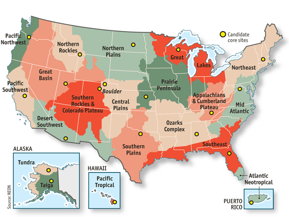

# Climate niche estimation

Setup and load packages

```{r setup, include=FALSE}
knitr::opts_chunk$set(echo = TRUE, message = FALSE)
```

```{r}
library(tidyverse)
library(sf)
# library(patchwork)
# library(plotly)
```

## GBIF

Explore GBIF data extracted by Josie.

```{r eval=FALSE}
gbif_josie <- read_rds("data/archives/CAGrasslandCommunityChange-master/Analysis/GBIF_Data/AllKaren_GBIF.rds")

gbif_josie %>% distinct(species.name)

gbif_josie %>%
  st_as_sf(coords = c("longitude", "latitude")) %>%
  ggplot() +
  geom_sf()
```
Get all species from newly tidy cover data.

```{r}
obs_cover <- read_rds("data/community/all-observational-data.rds") %>%
  # replace_na(list(abund = 0)) %>%
  filter(abund > 0) %>%
  group_by(site, year, plot) %>%
  mutate(rel_cover = abund / sum(abund)) %>%
  ungroup() %>%
  select(site, year, plot, species, guild, rel_cover)

site_spp_tbl <- obs_cover %>%
  group_by(site, species) %>%
  summarize(avg_rel_cover = mean(rel_cover)) %>%
  pivot_wider(names_from = site, values_from = avg_rel_cover, values_fill = 0) %>%
  rowwise() %>%
  mutate(avg_site = mean(c_across(Angelo:UCSC))) %>%
  arrange(desc(avg_site))
```

Prepare a master list of all the species.

```{r}
species_vec <- obs_cover %>%
  distinct(species) %>%
  arrange(species) %>%
  pull(species)
```

Extract occurrence data from GBIF, using the species list. The query output is an object of class `occdat`. Convert it to nested data, then unnest the data.

```{r eval=FALSE}
gbif_occ <- species_vec %>%
  spocc::occ(
    query = ., from = "gbif", has_coords = TRUE, limit = 1e6,
    gbifopts = list(
      continent = "north_america",
      country = "US",
      stateProvince = "California",
      hasGeospatialIssue = FALSE
    )
  )

gbif_tib <- gbif_occ$gbif$data %>%
  tibble(queryName = species_vec, gbif = .) %>%
  unnest(cols = c(gbif))

write_rds(gbif_tib, "data/occurrence/gbif/obs-spp-gbif.rds")
```

An outstanding question is the geographic extent to pull out GBIF data. Joise used California, but it seems to make more sense using an ecological, not administrative, boundary.


