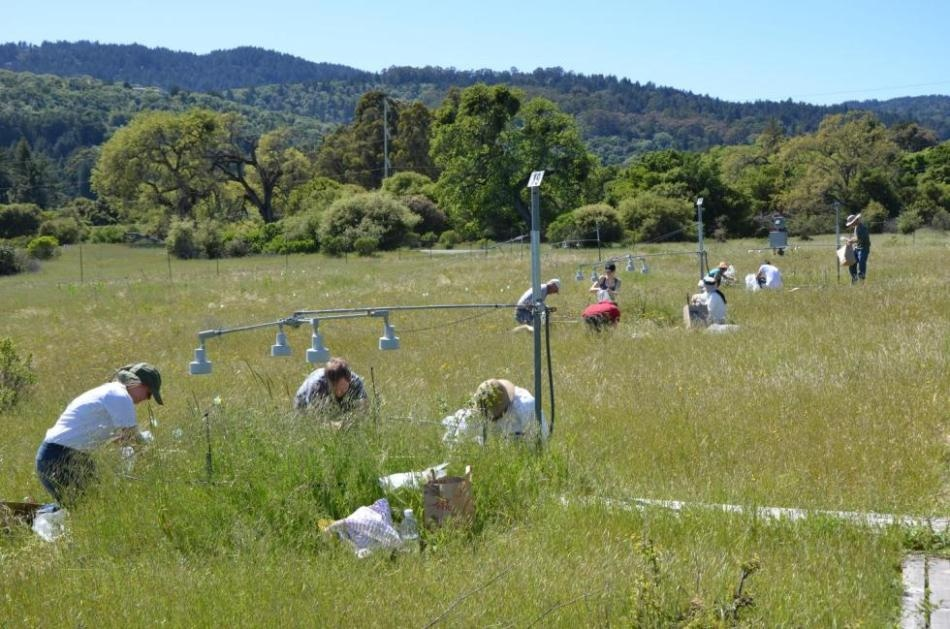

```{r setup, echo=FALSE, message=FALSE}
source("scripts/utils/setup.R")
```

# Species climate niches

Let's get community climate indexes: community temperature index (CTI) and community precipitation index (CPI) estimated from [GBIF](https://www.gbif.org/) occurrence data by Josie. Modified from Josie's code `Com_MajorAnalyses.Rmd` section `# Changes in wCTI over time`. Then plot CTI and CPI for all species.

```{r josie-niche-plot, fig.cap="Species climate niches estimated from GBIF by Josie"}
gbif_dat <- read_csv("data/community/raw/JosieGitHub/CAGrasslandCommunityChange-master/Analysis/CTI Data/AllSite_CTI_08_2020.csv") %>%
  select(-`...1`) %>%
  filter(
    species.name != "Linanthus jepsonii",
    species.name != "Linanthus latisectus",
    relcov >= 0
  ) %>%
  select(spnm = species.name, guild, tmp = meanT, ppt = meanp) %>%
  distinct()

(gbif_dat %>%
  mutate(nat_ext = str_sub(guild, 1, 1) %>%
    factor(levels = c("N", "E"), labels = c("Native", "Exotic"))) %>%
  ggplot(aes(tmp, ppt,
    color = nat_ext,
    text = spnm
  )) +
  geom_point(alpha = .5) +
  # geom_smooth(method = "lm", aes(tmp, ppt)) +
  labs(
    color = "Species",
    x = "Species occurrence mean temperature (°C)",
    y = "Species occurrence mean precipitation (mm)"
  ) +
  scale_color_manual(values = c("black", "red"))
) %>%
  plotly::ggplotly(tooltip = "text")
```

Note the strong negative correlation between mean temp and precip. Warmer locations are associated with drier locations. I talked with Greg and he agreed this is true in California--both geography (north-south) and elevation. The figure is interactive--you can hover your mouse to see if the data points and species names make sense.

Update: Karen said it would be helpful to plot native vs. exotic species. I found Josie had a column "guild" with some codes: `r unique(gbif_dat$guild)`. From Josie's code `ComComp Data Cleanup/Data_CleanupOnly.Rmd` lines 697-699, it looks like the 1st letter is **N**ative vs. **E**xotic, the 2nd letter is **A**nnual vs. **P**erennial, and the 3rd letter is lifeform **G**rass vs. **F**orb (but what are other characters?). So I extracted the 1st letter and recoded them into native vs. exotic. Karen confirmed that "The species that I know look correct as far as what I know about their temperature and precipitation distribution." (email 1/26/22)

# Experimental data

Analyze JRGCE species/community data.



The objectives are 

1. Look at species composition change over 17 yr
1. Compare species composition from ambient vs. elevated plots using the above community-level summary approach

First, get JRGCE data.

- Species abundance data: biomass, pin counts, presence/absence survey
- Species information: species code and name
- Treatment information: plot and treatment combinations

```{r}
# community abundance data
attach("data/archives/JRGCE/Input/Biomass/FG/All abundance and environment.rdata")
com_dat <- abund.dat %>% ungroup()
detach()

# treatment information
trt_dat <- read_csv("data/archives/JRGCE/Input/Biomass/NPP/Submission/Treatment.csv")

# species information
sp_jrgce <- read_csv("data/archives/JRGCE/Input/Biomass/CSV/Species.csv") %>%
  select(spcd = SPECIES_CODE, spnm = `Species or unit name`) %>%
  arrange(spnm)
```

Then, match JGRCE species to Josie's species with CTI/CPI to get community climate index (CCI) data.

```{r}
cci_dat <- gbif_dat %>%
  distinct(spnm, tmp, ppt) %>%
  arrange(spnm) %>%
  inner_join(sp_jrgce, by = "spnm") %>%
  select(spcd, spnm, tmp, ppt)
```

Note that GBIF has only 41 species available out of 98 species in JRGCE. 

Check those species climate niches. Again, strong negative correlation.

```{r, fig.cap="Species climate niches for a subset of species in Jasper Ridge"}
(cci_dat %>%
  ggplot(aes(tmp, ppt, text = spnm)) +
  geom_point(alpha = .5) +
  geom_smooth(method = "lm") +
  labs(
    x = "Species occurrence mean temperature (°C)",
    y = "Species occurrence mean precipitation (mm)"
  )
) %>%
  plotly::ggplotly(tooltip = "text")
```

Assign community-level temp/precip to plots.

```{r}
# assign community-level temp/precip to plots
cci_jrgce_dat <- com_dat %>%
  select(yr, plt, spcd = sp, bio, pin, pa1, pa2) %>%
  inner_join(cci_dat, by = "spcd") %>%
  group_by(yr, plt) %>%
  summarize(
    bio_tmp = sum(bio * tmp) / sum(bio),
    bio_ppt = sum(bio * ppt) / sum(bio),
    pin_tmp = sum(pin * tmp) / sum(pin),
    pin_ppt = sum(pin * ppt) / sum(pin)
  ) %>%
  left_join(trt_dat, by = c("yr", "plt"))
```

Compare CTI from ambient vs. elevated temp plots, with all the other treatments at the ambient conditions. We can use either biomass as the weight or pin count as the weight. Greg said pin count is more commonly used to reflect community composition. 

Their CTI are similar in the beginning and then diverge (warming plots have warmer species) later.

```{r, fig.cap="Compare CTI in ambient vs. elevated warming treatments over years"}
cci_jrgce_dat %>%
  mutate(tmp = factor(tmp, 0:1, c("Ambient", "Elevated"))) %>%
  filter(ppt == 0, co2 == 0, ntg == 0) %>%
  drop_na() %>% # a few plots have no estimates, due to missing species niche info
  ggplot(aes(yr, pin_tmp, col = tmp, group = tmp)) +
  geom_point(alpha = .5) +
  geom_smooth() +
  labs(
    x = "Year", y = "Community Temperature Index (CTI, °C)",
    color = "Warming treatment"
  ) +
  scale_color_manual(values = c("black", "red"))
```

Boxplots to compare both treatment effects and long-term (year) effects.

```{r, fig.cap="Compare CTI in ambient vs. elevated warming treatments over years"}
cci_jrgce_dat %>%
  mutate(
    tmp = factor(tmp, 0:1, c("Ambient", "Elevated")),
    yr = as.factor(yr)
  ) %>%
  filter(ppt == 0, co2 == 0, ntg == 0) %>%
  drop_na() %>%
  ggplot(aes(yr, pin_tmp, col = tmp, group = interaction(tmp, yr))) +
  geom_boxplot() +
  ggpubr::stat_compare_means(
    aes(group = tmp),
    method = "wilcox.test",
    label = "p.signif", hide.ns = FALSE
  ) +
  labs(
    x = "Year", y = "Community Temperature Index (CTI, °C)",
    color = "Warming treatment"
  ) +
  scale_color_manual(values = c("black", "red"))
```

Likewise, we can compare precipitation treatment (elevated means adding water). Note this is not a drought experiment. Plots with added water have species like high precip.

```{r, fig.cap="Compare CPI in ambient vs. elevated adding water treatments over years"}
cci_jrgce_dat %>%
  mutate(ppt = factor(ppt, 0:1, c("Ambient", "Elevated"))) %>%
  filter(tmp == 0, co2 == 0, ntg == 0) %>%
  drop_na() %>% # a few plots have no estimates, due to missing species niche info
  ggplot(aes(yr, pin_ppt, col = ppt, group = ppt)) +
  geom_point(alpha = .5) +
  geom_smooth() +
  labs(
    x = "Year", y = "Community Precipitation Index (CPI, mm)",
    color = "Add-water treatment"
  ) +
  scale_color_manual(values = c("black", "blue"))
```

Boxplots to compare both treatment effects and long-term (year) effects.

```{r, fig.cap="Compare CPI in ambient vs. elevated adding water treatments over years"}
cci_jrgce_dat %>%
  mutate(
    ppt = factor(ppt, 0:1, c("Ambient", "Elevated")),
    yr = as.factor(yr)
  ) %>%
  filter(tmp == 0, co2 == 0, ntg == 0) %>%
  drop_na() %>%
  ggplot(aes(yr, pin_ppt, col = ppt, group = interaction(ppt, yr))) +
  geom_boxplot() +
  ggpubr::stat_compare_means(
    aes(group = ppt),
    method = "wilcox.test",
    label = "p.signif", hide.ns = FALSE
  ) +
  labs(
    x = "Year", y = "Community Precipitation Index (CPI, mm)",
    color = "Add-water treatment"
  ) +
  scale_color_manual(values = c("black", "blue"))
```

Put CTI and CPI together.

Treatment combinations: symbol "_" means ambient, "T" means elevated temperature, "P" means elevated precipitation (added water), etc.

```{r, fig.cap="Median community weighted temperature and precipitation indexes from ambient and elevated temp and preip treatments over years"}
cci_jrgce_avg <- cci_jrgce_dat %>%
  mutate(trt = paste0( # single tag for treatment combinations
    ifelse(tmp == 0, "_", "T"),
    ifelse(ppt == 0, "_", "P"),
    ifelse(co2 == 0, "_", "C"),
    ifelse(ntg == 0, "_", "N")
  )) %>%
  group_by(yr, trt) %>% # average by year and treatment combo
  summarize(pin_tmp = mean(pin_tmp), pin_ppt = mean(pin_ppt))

cci_jrgce_avg %>%
  filter(trt %in% c("____", "T___", "_P__", "TP__")) %>%
  ggplot(aes(pin_tmp, pin_ppt, col = yr)) +
  geom_path() +
  facet_wrap(~trt) +
  labs(
    x = "Community Temperature Index (CTI, °C)",
    y = "Community Precipitation Index (CPI, mm)",
    col = "Year"
  ) +
  scale_color_viridis_c()
```

The above figure shows comparing to ambient plots, added water treatment makes community shift to wetter species, and warming treatment makes community shift to warmer species. It's almost like an ordination plot, but even better with biologically meaningful values (CTI, CPI).

What about elevated CO2 treatment?

```{r, fig.cap="Compare temp and precip treatment effects for elevated CO2 plots"}
cci_jrgce_avg %>%
  filter(trt %in% c("__C_", "T_C_", "_PC_", "TPC_")) %>%
  ggplot(aes(pin_tmp, pin_ppt, col = yr)) +
  geom_path() +
  facet_wrap(~trt) +
  labs(
    x = "Community Temperature Index (CTI, °C)",
    y = "Community Precipitation Index (CPI, mm)",
    col = "Year"
  ) +
  scale_color_viridis_c()
```

From the above figure, we can see preip effect dampens, but temp effect is still strong.

What about elevated nitrogen plots?

```{r, fig.cap="Compare temp and precip treatment effects for elevated nitrogen plots"}
cci_jrgce_avg %>%
  filter(trt %in% c("___N", "T__N", "_P_N", "TP_N")) %>%
  ggplot(aes(pin_tmp, pin_ppt, col = yr)) +
  geom_path() +
  facet_wrap(~trt) +
  labs(
    x = "Community Temperature Index (CTI, °C)",
    y = "Community Precipitation Index (CPI, mm)",
    col = "Year"
  ) +
  scale_color_viridis_c()
```

Same story. Precip effect weakens, but temp effect stay strong.

What about both elevated CO2 and nitrogen plots?

```{r, fig.cap="Compare temp and precip treatment effects for elevated CO2 and nitrogen plots"}
cci_jrgce_avg %>%
  filter(trt %in% c("__CN", "T_CN", "_PCN", "TPCN")) %>%
  ggplot(aes(pin_tmp, pin_ppt, col = yr)) +
  geom_path() +
  facet_wrap(~trt) +
  labs(
    x = "Community Temperature Index (CTI, °C)",
    y = "Community Precipitation Index (CPI, mm)",
    col = "Year"
  ) +
  scale_color_viridis_c()
```

Change in environmental variables, focusing on temp and precip.

```{r}
env_dat <- read_csv("data/archives/JRGCE/Input/Biomass/NPP/Submission/Environment.csv") %>%
  pivot_wider(names_from = "var", values_from = "env") %>%
  select(yr, trt, tmp, ppt) %>%
  mutate(
    tmp_trt = ifelse(trt == 0, "_", "T"),
    ppt_trt = ifelse(trt == 0, "_", "P")
  )

tmp_dat <- select(env_dat, yr, tmp_trt, tmp)
ppt_dat <- select(env_dat, yr, ppt_trt, ppt)

tmp_ppt_dat <- expand_grid(yr = 1998:2014, tmp_trt = c("_", "T"), ppt_trt = c("_", "P")) %>%
  left_join(tmp_dat, by = c("yr", "tmp_trt")) %>%
  left_join(ppt_dat, by = c("yr", "ppt_trt")) %>%
  drop_na() %>%
  unite("trt", tmp_trt:ppt_trt, sep = "")

tmp_ppt_dat %>%
  ggplot(aes(tmp, ppt, col = yr)) +
  geom_path() +
  facet_wrap(~trt) +
  labs(
    x = "Temperature (deg C)", y = "Precipitation (mm)",
    col = "Year"
  ) +
  scale_color_viridis_c()
```

Now, let's explore the Santa Cruz International Drought Experiment (SCIDE).

```{r fig.cap="Species climate niches for a subset of species in SCIDE"}
(gbif_dat %>%
  select(species = spnm, guild, tmp, ppt) %>%
  distinct() %>%
  inner_join(read_csv("data/community/tidy/scide.csv", col_types = "ciccccdc") %>%
    select(species) %>%
    distinct(), by = "species") %>%
  ggplot(aes(tmp, ppt, text = species)) +
  geom_point(alpha = .5) +
  labs(
    x = "Species occurrence mean temperature (°C)",
    y = "Species occurrence mean precipitation (mm)"
  )
) %>%
  plotly::ggplotly(tooltip = "text")
```

Note that only 38 species have data from GBIF out of 73 species in SCIDE.

Calculate CTI and CPI for year-site-plot-treatment combinations.

```{r}
cci_scide_dat <- read_csv("data/community/tidy/scide.csv", col_types = "ciccccdc") %>%
  select(site, year, plot, treat, species, guild, cover = abund) %>%
  inner_join(select(gbif_dat, species = spnm, tmp, ppt) %>% distinct(), by = "species") %>%
  group_by(year, site, plot, treat) %>%
  summarize(
    cover_tmp = sum(cover * tmp) / sum(cover),
    cover_ppt = sum(cover * ppt) / sum(cover)
  )
```

Plot CTI and CPI wrt year and treatment.

```{r fig.cap="Compare CTI in ambient vs. drought treatments over years"}
cci_scide_dat %>%
  mutate(treat = case_when(
    treat == "_" ~ "Ambient",
    treat == "D" ~ "Drought"
  )) %>%
  ggplot(aes(year, cover_tmp, col = treat, group = interaction(treat, year))) +
  geom_boxplot() +
  ggpubr::stat_compare_means(
    aes(group = treat),
    method = "wilcox.test",
    label = "p.signif", hide.ns = FALSE
  ) +
  facet_wrap(~site) +
  labs(
    x = "Year", y = "Community Temperature Index (CTI, °C)",
    color = "Treatment"
  ) +
  scale_color_manual(values = c("black", "red"))
```

```{r fig.cap="Compare CPI in ambient vs. drought treatments over years"}
cci_scide_dat %>%
  mutate(treat = case_when(
    treat == "_" ~ "Ambient",
    treat == "D" ~ "Drought"
  )) %>%
  ggplot(aes(year, cover_ppt, col = treat, group = interaction(treat, year))) +
  geom_boxplot() +
  ggpubr::stat_compare_means(
    aes(group = treat),
    method = "wilcox.test",
    label = "p.signif", hide.ns = FALSE
  ) +
  facet_wrap(~site) +
  labs(
    x = "Year", y = "Community Precipitation Index (CPI, mm)",
    color = "Treatment"
  ) +
  scale_color_manual(values = c("black", "red"))
```

# Observational data

The objectives are

1. Replicate Josie's key results on CTI change
1. Compare with site-level climate change

Get plot-level and site-level summaries.

```{r, fig.cap="Replicate Josie's Figure CTI"}
josie_dat <- read_csv("data/community/raw/JosieGitHub/CAGrasslandCommunityChange-master/Analysis/CTI Data/AllSite_CTI_08_2020.csv") %>%
  select(-`...1`) %>%
  filter(
    species.name != "Linanthus jepsonii",
    species.name != "Linanthus latisectus",
    relcov >= 0
  )

cci_plot_sum <- josie_dat %>%
  group_by(site, plot, year) %>%
  mutate(
    relCTI = relcov * meanT,
    relCPI = relcov * meanp
  ) %>%
  summarise(
    plotCTI = sum(relCTI),
    plotCPI = sum(relCPI)
  ) %>%
  arrange(site, plot, year)

cci_site_sum <- cci_plot_sum %>% # from plot summary, can redo using indiviual obs
  group_by(site, year) %>%
  summarise(
    meanCTI = mean(plotCTI),
    seCTI = plotrix::std.error(plotCTI),
    meanCPI = mean(plotCPI),
    seCPI = plotrix::std.error(plotCPI)
  )

cci_site_gg <- ggplot(cci_site_sum, aes(
  x = year,
  y = meanCTI, ymin = meanCTI - seCTI, ymax = meanCTI + seCTI
)) +
  geom_pointrange() +
  geom_line() +
  facet_wrap(~site, scales = "free", nrow = 2)

cci_site_gg +
  labs(
    x = "Year",
    y = "Community Temperature Index (CTI, °C)"
  )
```

Note that the goal was to replicate Josie's manuscript Figure CTI. The data look right, but two sites, Jasper and UCSC, seem to be mislabeled. 
Then, get site climate data. Modified from Josie's code `Com_MajorAnalyses.Rmd` subsection `## CTI vs actual temp`.

```{r, fig.cap="Replicate Josie's Figure weather"}
clim_dat <- read_csv("data/community/raw/JosieGitHub/CAGrasslandCommunityChange-master/Analysis/ClimData/PRISM_wtryr_alldata.csv") %>%
  select(-`...1`)

clim_site_sum <- josie_dat %>%
  distinct(site, year) %>%
  left_join(clim_dat, by = c("site" = "site", "year" = "wateryear")) %>%
  mutate(grow_meanT = (grow_minT + grow_maxT) / 2) # grow_meanT is highly correlated with mean_meanT

clim_site_gg <- clim_site_sum %>%
  ggplot(aes(x = year, y = grow_meanT)) + # ymin = grow_minT, ymax = grow_maxT
  geom_point() +
  geom_line() +
  facet_wrap(~site, scales = "free", nrow = 2)

clim_site_gg +
  labs(
    x = "Year",
    y = "Growing season temperature (°C)"
  )
```

Note that the goal was to replicate Josie's manuscript Figure weather and Table weather models. It looks right to me (no mislabel).

Finally, combine climate change and community change. 

Time-series plots of site-level climate change and site-level community climate index change.

```{r, fig.cap="Compare long-term climate change vs. community change summarized by CTI", fig.height=10}
(clim_site_gg +
  geom_smooth(method = "lm") +
  labs(title = "(a) Climate change", x = "", y = "Growing season temperature (°C)")) /
  (cci_site_gg +
    geom_smooth(method = "lm") +
    labs(title = "(b) Community change", x = "Year", y = "Community Temperature Index (CTI, °C)"))
```

I think the comparison looks very interesting. Climate change seems to drive community composition change.

Directly compare site-level climate values to community climate index seems less intuitive. 

```{r, fig.cap="Compare site average temperature vs. CTI"}
clim_site_sum %>%
  full_join(cci_site_sum, by = c("site", "year")) %>%
  ggplot(aes(
    x = grow_meanT,
    y = meanCTI, ymin = meanCTI - seCTI, ymax = meanCTI + seCTI
  )) +
  geom_pointrange() +
  facet_wrap(~site, scales = "free", nrow = 2) +
  geom_smooth(method = "lm") +
  labs(
    x = "Growing season temperature (°C)",
    y = "Community Temperature Index (CTI, °C)"
  )
```

Joint CTI and CPI analysis.

```{r, fig.cap="Community shift across all sites"}
cci_site_sum %>%
  ggplot() +
  geom_path(aes(meanCTI, meanCPI, col = year)) +
  facet_wrap(~site, scales = "free") +
  labs(
    x = "Community Temperature Index (CTI, °C)",
    y = "Community Precipitation Index (CPI, mm)",
    col = "Year"
  ) +
  scale_color_viridis_c()
```
